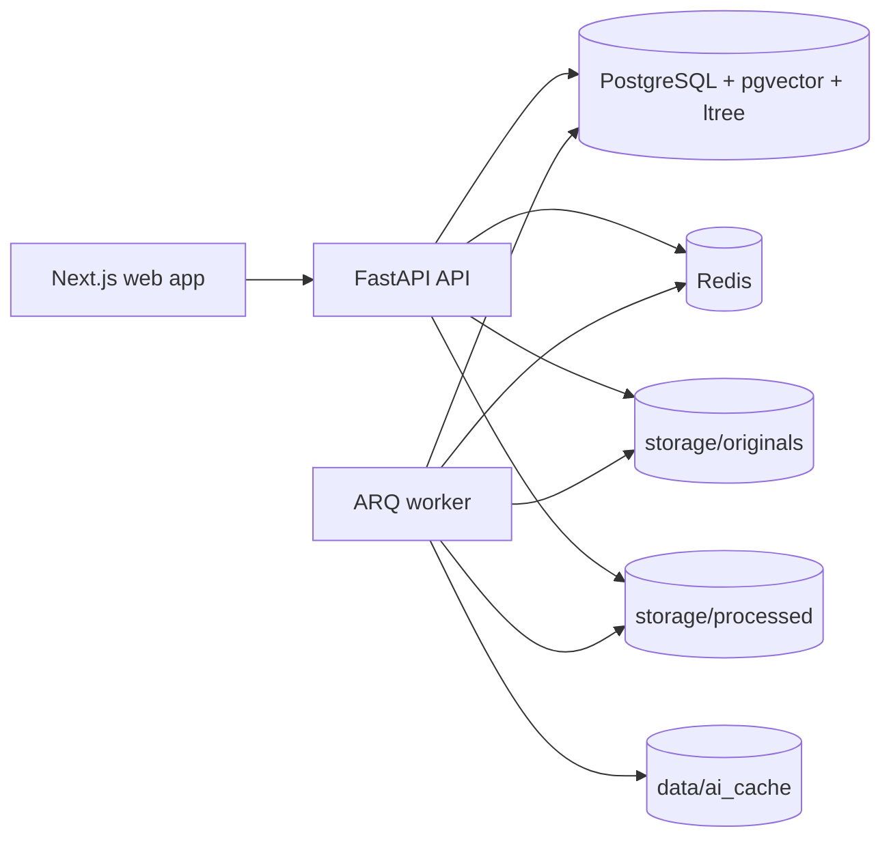

# Photo Manager

Self-hosted photo and video management with a database-first design, cursor-based browsing, timeline navigation, derived previews, semantic search, face recognition, people management, and soft-delete trash flows.

## Overview

- Goal:
  - Replace cloud photo libraries with a private, self-hosted workflow.
  - Keep originals as the source media.
  - Keep app state and metadata in PostgreSQL.
  - Add AI features without exposing raw embeddings through normal APIs.
- Current backend features:
  - Asset upload and path-based ingest.
  - Bulk library scan from the originals directory.
  - Metadata-first ingestion with eager tiny/small thumbnails.
  - API-owned storage rules maintenance with dry-run planning and rerun-safe reconciliation.
  - Cursor-based active asset browsing for large libraries.
  - Timeline month/day APIs for jump-to-date scrolling.
  - On-demand preview generation through a combined asset preview endpoint.
  - CLIP-based semantic search.
  - InsightFace face detection and face embedding storage.
  - Incremental face matching for newly processed and restored assets.
  - Bulk clustering for remaining unassigned faces.
  - People naming, hiding, merging, thumbnail selection, and person filtering.
  - Soft delete, trash listing, and restore.
  - Background jobs and in-app notifications.

## Architecture

### Runtime layout

- `db`: PostgreSQL 16 with `pgvector`.
- `redis`: ARQ queue backend.
- `api`: FastAPI app.
- `worker`: ARQ worker for metadata, batch thumbnail, preview, embedding, face, clustering, and scan jobs.
- `api` also runs an internal executor for API-owned maintenance jobs that must mutate `storage/originals/`.
- `web`: Next.js app in `web/`, currently run separately from `docker-compose.yml`.



### Tech stack

| Area | Implementation |
| --- | --- |
| Backend | FastAPI, SQLModel, SQLAlchemy, Alembic |
| Database | PostgreSQL 16, `pgvector`, `ltree` |
| Queue / jobs | Redis + ARQ |
| Frontend | Next.js 15, React 19, TypeScript, React Query, Tailwind |
| Image/video processing | Pillow, `pillow-heif`, `ffmpeg`, `ffprobe`, BlurHash |
| Semantic search | OpenCLIP (`openclip-vit-b-32`, `laion2b_s34b_b79k`) |
| Face detection | InsightFace Buffalo-L via ONNX Runtime |
| Auth | Bearer access JWT + rotating refresh token cookie |

### Storage and data model principles

- Originals:
  - Host path: `storage/originals/`
  - Container path: `/media/originals`
  - Source-of-truth media files.
  - API has write access; worker mounts this directory read-only for safety.
- Derived files:
  - Host path: `storage/processed/`
  - Container path: `/media/processed`
  - Regeneratable thumbnails, previews, and people thumbnails.
- Metadata:
  - Stored in PostgreSQL.
  - Paths are stored relative to the originals root.
  - No sidecar metadata files are used.

### Security and privacy decisions

- The app is intended for self-hosted/private deployment.
- Originals are never physically deleted by the API delete flow.
- Soft delete uses `assets.deleted_at`; active queries exclude deleted assets unless a trash route is used.
- Access tokens are bearer JWTs; refresh tokens are stored as hashed DB records and rotated via an `HttpOnly` cookie on `/api/v1/auth`.
- Face and CLIP embeddings are stored in the database, but normal API response schemas do not expose embedding vectors.

## Repository structure

```text
.
├── backend/
│   ├── alembic/
│   │   └── versions/              # schema migrations
│   ├── app/
│   │   ├── api/v1/features/       # FastAPI route modules by feature
│   │   ├── core/                  # DB, auth, security, logging
│   │   ├── services/              # domain services, repositories, jobs
│   │   └── models.py              # SQLModel table models
│   ├── worker/                    # ARQ worker entrypoint, settings, task wiring
│   ├── Dockerfile
│   ├── requirements.txt
│   └── alembic.ini
├── web/
│   ├── src/app/                   # Next.js app routes
│   ├── src/components/            # UI pages and shared components
│   └── src/lib/                   # API client, types, session helpers
├── mobile/                        # placeholder only at the moment
├── storage/
│   ├── originals/                 # source media
│   └── processed/                 # generated previews/thumbnails
├── data/
│   ├── ai_cache/                  # model/runtime cache
│   ├── db/                        # Postgres data dir
│   └── redis/                     # Redis appendonly data
├── docker-compose.yml
├── Justfile
├── openspec/                      # change proposals, designs, tasks, specs
└── README.md
```

### Backend conventions

- Routes live under `backend/app/api/v1/features/`.
- Domain logic lives under `backend/app/services/`.
- Manual maintenance jobs use handler classes under `backend/app/services/manual_jobs/`.
- Some manual jobs are worker-executed, while filesystem-mutating jobs such as storage rules are API-executed.
- Generic processing state tracking lives under `backend/app/services/asset_processing/`.
- Repositories are used for persistence-heavy operations such as:
  - active vs deleted asset access
  - people and face queries
  - vector nearest-neighbour queries
- Background worker entrypoints stay thin:
  - `backend/worker/tasks.py` delegates to service-level task functions
  - shared task/job lifecycle helpers live under `backend/app/services/jobs/`
- API-owned maintenance execution is started from app lifespan and is used for jobs that must write to originals safely.
- Model-runtime boundaries are explicit where they are likely to vary:
  - `backend/app/services/embeddings/provider.py` defines the embedding provider seam
  - `backend/app/services/face_detection/provider.py` defines the face-detection provider seam
- SQLModel table models are centralized in `backend/app/models.py`.
- Worker task registration lives in `backend/worker/`.

### Frontend conventions

- Route entrypoints live in `web/src/app/`.
- Feature UI lives in `web/src/components/`.
- API calls live in `web/src/lib/api/`.
- Shared response/request types live in `web/src/lib/types.ts`.

## Database schema

The schema is defined in [backend/app/models.py](backend/app/models.py) and migrated through [backend/alembic/versions](backend/alembic/versions).

### Core tables

| Table | Purpose | Important fields |
| --- | --- | --- |
| `assets` | Primary media metadata and browse fields | `id`, `file_hash`, `master_path`, `mime_type`, `captured_at`, `captured_at_local`, `timeline_at`, `timeline_day`, `timeline_month`, `media_kind`, `search_vector`, `search_model_id`, `deleted_at`, `preview_status` |
| `asset_processing` | Shared processing state for AI and preview tasks | `asset_id`, `ai_model_id`, `task`, `status`, `last_job_id`, `processed_at`, `error_message` |
| `faces` | Detected faces and face embeddings | `asset_id`, `person_id`, `embedding`, `face_model_id`, `bounding_box`, `confidence`, `is_confirmed`, `is_excluded`, `crop_path` |
| `people` | Named or unnamed person clusters | `name`, `thumbnail_face_id`, `thumbnail_path`, `thumbnail_manually_set`, `is_hidden` |
| `ai_models` | Registered AI model versions | `task`, `model_name`, `version_tag`, `vector_dimensions`, `is_deprecated` |
| `ai_model_defaults` | Current default model per task | `task`, `model_id`, `updated_at` |
| `jobs` | Background job tracking | `type`, `status`, `progress_*`, `parameters`, `result`, `error_message` |
| `notifications` | User-visible system events | `level`, `category`, `title`, `message`, `details`, `related_job_id`, `related_asset_id`, `read_at` |
| `tags` | Hierarchical tags | `name`, `path`, `description` |
| `asset_tags` | Asset-to-tag join table | `asset_id`, `tag_id` |
| `users` | Local auth users | `username`, `password_hash`, `is_active` |
| `refresh_tokens` | Refresh token rotation state | `user_id`, `token_hash`, `expires_at`, `revoked_at`, `replaced_by_token_id` |

### Notes by area

- Asset embeddings:
  - There is no separate `asset_embeddings` table.
  - CLIP vectors are stored directly on `assets.search_vector`.
  - `assets.search_model_id` identifies which CLIP model generated that vector.
- Processing state:
  - `asset_processing` replaces the old AI-only processing table.
  - `ai_model_id` is nullable for non-model tasks such as preview generation.
  - current tasks include CLIP embeddings, face recognition, image previews, and video previews.
- Faces:
  - `faces.face_model_id` isolates face embeddings by InsightFace model version.
  - `faces.person_id` drives people filtering, people counts, and search/person summaries.
  - `faces.is_confirmed` and `faces.is_excluded` preserve manual corrections and exclusions.
- People thumbnails:
  - `people.thumbnail_face_id` tracks which face is being used for the person thumbnail.
  - `people.thumbnail_path` stores the generated file path.
  - `people.thumbnail_manually_set` distinguishes manual selection from auto-generated thumbnails.
- Soft delete:
  - `assets.deleted_at IS NULL` means active.
  - `assets.deleted_at IS NOT NULL` means trashed.
- Timeline materialization:
  - `timeline_at` is the effective browse timestamp.
  - `timeline_day` and `timeline_month` are lightweight derived browse buckets.
  - `captured_at_local` stays as the raw local EXIF timestamp string so local calendar grouping remains regeneratable.

### Extensions and indexes

- Extensions created by Alembic:
  - `vector`
  - `ltree`
- Vector/HNSW indexes:
  - `assets.search_vector` HNSW index for CLIP search via migration `0003_asset_search_vector_hnsw.py`
  - `faces.embedding` HNSW index for general face similarity
  - partial assigned-face HNSW index on `faces.embedding` where `person_id IS NOT NULL AND is_excluded = false` for incremental matching
- Other notable indexes:
  - `idx_assets_captured_at`
  - `idx_assets_active_timeline_desc`
  - `idx_assets_active_month_timeline_desc`
  - `idx_assets_active_day_timeline_desc`
  - `idx_assets_active_media_timeline_desc`
  - `idx_faces_asset_id`
  - `idx_faces_person_id`
  - `idx_faces_person_asset_active`
  - `idx_faces_face_model_id`
  - `idx_tags_path_gist`

## Storage layout

### Originals

- Host: `storage/originals/`
- Container: `/media/originals`
- Uploads are first staged under `/media/originals/.tmp`.
- Canonical stored path format for uploads:
  - `YYYY/MM/<sha256><suffix>`
- `assets.master_path` stores the relative path under the originals root.

### Generated files

- Asset preview directory:
  - `/media/processed/assets/<asset_id>/`
- Generated asset files:
  - `tiny.webp`
  - `small.webp`
  - `large.webp` for generated large image previews
  - `preview.mp4` for generated video previews
- People thumbnails:
  - relative path prefix: `generated/people/thumbnails/`
  - current filename pattern: `<person_id>.webp`

### Source of truth vs derived data

- Source of truth:
  - originals in `storage/originals/`
  - metadata and app state in PostgreSQL
- Derived and regeneratable:
  - asset thumbnails and previews
  - people thumbnail files
  - AI cache under `data/ai_cache/`

### Delete / restore impact

- Soft delete does not physically remove:
  - original media
  - generated previews/thumbnails unless explicitly regenerated later

## Manual jobs

- Manual jobs are exposed through `/api/v1/jobs/available` and `/api/v1/jobs/<job_key>/run`.
- Job parameters are declared by backend handler definitions and consumed by the frontend test launcher dynamically.
- `apply_storage_rules`:
  - defaults to `dry_run=true`
  - is executed by the API, not the worker
  - plans canonical original-path moves and applies them only when `dry_run=false`
  - commits `assets.master_path` updates in batches while relying on rerun-safe reconciliation if filesystem and DB drift after interruption
- Storage-rules reruns are intended to continue safely from current filesystem state:
  - already compliant assets are skipped
  - moved-on-disk but stale-in-DB assets are reconciled
  - conflicting or missing-source assets are reported in the job result
  - asset row
  - face rows
  - CLIP vectors on `assets`
  - tag joins
  - generated asset previews
- People may be deleted if they no longer have any active assets.
- Restoring an asset requires the original source file to still exist.
- Restore can requeue lightweight metadata work if eager thumbnails are missing.
- Heavy previews are regenerated on first demand through the preview endpoint.

## Core workflows

### Upload / ingest

1. A file is uploaded to `/api/v1/assets/upload` or ingested by path via `/api/v1/assets/ingest`.
2. The backend validates the media type and computes a SHA-256 file hash.
3. The asset is deduplicated by `file_hash`.
4. For new assets:
   - the asset row is created
   - eager lightweight artifacts are generated immediately or via FastAPI background tasks
   - metadata processing is enqueued
5. For existing assets:
   - the existing row is returned
   - missing eager thumbnails or incomplete metadata may trigger reprocessing
6. If the matching asset was soft-deleted and restore is allowed, the existing row is restored instead of creating a new one.

### Bulk scan

1. `POST /api/v1/jobs/bulk_scan/run` creates a manual job.
2. The worker walks `storage/originals/` recursively, excluding `.tmp`.
3. Supported files are hashed and deduplicated by `file_hash`.
4. Each asset row is created or reused from metadata-first scan results.
5. Tiny/small thumbnails are generated eagerly.
6. CLIP and face work are queued in batches.
7. Notifications are written for scan start/completion/failures.

### Metadata processing

1. `process_asset_metadata` loads the original file.
2. EXIF is extracted for images.
3. Eager variants are ensured:
   - `tiny.webp`
   - usually `small.webp` for JPEG/PNG under the size threshold
   - middle-frame preview for video-derived thumbnails
4. Video width/height/codec/duration metadata is refreshed when needed.
5. When metadata processing completes it can enqueue:
   - CLIP embedding generation
   - face processing for images
6. Timeline browse fields are recomputed whenever metadata changes.

### Preview generation

1. Assets expose a single `preview_url` pointing to `GET /api/v1/assets/{asset_id}/preview`.
2. The endpoint resolves preview behavior by asset type:
   - images serve the original file when a generated large preview is unnecessary
   - images serve `large.webp` when a generated preview exists
   - videos serve `preview.mp4` when the generated preview exists
3. If a required preview is missing:
   - the endpoint queues preview generation
   - the request returns `202 Accepted`
4. Internal generation remains split:
   - image preview generation
   - video preview generation/transcoding

### Active browsing and timeline

1. `GET /api/v1/assets` is the canonical active asset feed.
2. It uses cursor pagination rather than deep offset pagination.
3. Ordering is stable for large libraries:
   - `timeline_at DESC`
   - `id DESC`
4. Optional filters include:
   - `media_kind`
   - `month`
   - `day`
   - `person_ids`
5. `GET /api/v1/timeline/months` returns month buckets for scrollbar/jump navigation.
6. `GET /api/v1/timeline/days?month=YYYY-MM-01` returns day buckets within a month.
7. Grid/search responses are intentionally lightweight and do not include heavy tag/face hydration.

### CLIP embedding and search

1. The current CLIP default model is read from `ai_model_defaults`.
2. `EmbeddingService` delegates model execution through an embedding provider interface.
3. `generate_for_asset()` stores the vector on `assets.search_vector` and records the model in `assets.search_model_id`.
4. `GET /api/v1/search` embeds the text query with the current default CLIP model.
5. Search returns active assets only, optionally filtered by person IDs.
6. Search now uses cursor pagination instead of offset pagination.

### Face detection

1. Face processing uses the current default `face_recognition` model from `ai_model_defaults`.
2. `FaceProcessingService` resolves a face-detection provider and uses the default InsightFace-backed implementation unless a different provider is injected.
3. Images are passed through InsightFace Buffalo-L.
4. Each detected face stores:
   - bounding box
   - confidence
   - embedding
   - `face_model_id`
   - unconfirmed/unexcluded defaults
5. Existing confirmed faces are preserved on forced reprocessing.

### Incremental face matching

Used after new face detection and after restore follow-up when current-model faces already exist.

1. Candidate faces are limited to:
   - the current asset
   - current face model only
   - unassigned
   - unconfirmed
   - non-excluded
   - embedding present
2. Each candidate queries nearest assigned reference faces using pgvector cosine distance.
3. Neighbours are grouped by `person_id`.
4. An assignment is made only when the best person passes:
   - distance threshold
   - minimum support count
   - margin vs second-best person
5. Assigned faces keep `is_confirmed = false`.
6. Matched people thumbnails are refreshed if needed.

### Bulk face clustering

1. `POST /api/v1/jobs/cluster_faces/run` enqueues a clustering job.
2. The clustering service only considers unassigned candidate faces for the current face model.
3. Connected components are built from neighbour links under a distance threshold.
4. A component either:
   - attaches to exactly one existing labeled person
   - creates a new unnamed person if large enough
   - is skipped if ambiguous or too small

### People management

- People list/detail APIs are driven by `faces.person_id`.
- Naming or hiding a person updates the `people` row directly.
- Manual face assignment is done by patching a face.
- Merging people reassigns faces from source to target, deletes the source person, and refreshes thumbnails.
- People-filtered asset browsing now goes through `GET /api/v1/assets?person_ids=...` instead of a dedicated per-person asset list route.
- Person thumbnails:
  - can be automatically selected from the best face candidate
  - can be manually set from a specific asset
  - use a cache-busting `face_id` query parameter in API serialization when a thumbnail face exists

### Soft delete, trash, and restore

#### Delete

1. `DELETE /api/v1/assets/{asset_id}` only targets active assets.
2. The service records impacted `person_id` values from that asset’s faces.
3. It sets `assets.deleted_at = now()`.
4. It reconciles impacted people:
   - orphaned people are deleted
   - retained people may get refreshed thumbnails

#### Trash

- `GET /api/v1/trash/assets`
  - paginated trashed assets only
  - sorts by deletion date or taken date
- `GET /api/v1/trash/assets/{asset_id}`
  - deleted asset detail only

#### Restore

1. Restore loads the asset only if `deleted_at IS NOT NULL`.
2. It requires the original source file to still exist.
3. `deleted_at` is cleared.
4. Existing linked people are reconciled.
5. Follow-up work then runs:
   - requeue metadata only if eager thumbnails or lightweight metadata are missing
   - enqueue CLIP only if the current default model embedding is missing or outdated
   - run incremental face matching immediately if current-model faces already exist
   - otherwise enqueue face detection with `auto_match=true`
6. Deleted people are not recreated automatically; restored faces remain unassigned unless current matching can reattach them confidently.

### Jobs and notifications

- Long-running operations write to `jobs`.
- Queue-triggered flows also write user-facing `notifications`.
- Shared worker lifecycle state transitions such as `running`, `failed`, `completed`, and manual parent-child completion hooks are centralized in `backend/app/services/jobs/context.py`.
- Current job families include:
  - library scan
  - asset metadata processing
  - asset preview generation
  - batch thumbnail generation
  - CLIP embedding generation / backfill
  - face processing / backfill
  - people clustering

## Getting started

### Prerequisites

- Docker and Docker Compose
- Node.js 20+ for the web app
- Enough local disk space for:
  - `storage/originals`
  - `storage/processed`
  - `data/db`
  - `data/redis`
  - `data/ai_cache`

### Environment setup

Create a repo-root `.env` file:

```env
POSTGRES_DB=photo_manager
POSTGRES_USER=photo_manager
POSTGRES_PASSWORD=photo_manager
POSTGRES_PORT=5432
REDIS_PORT=6379
API_PORT=8000
JWT_SECRET=replace-with-a-long-random-secret
```

### Start backend services

From the repo root:

```bash
just up
```

Or:

```bash
docker compose up --build
```

Useful helpers:

```bash
just up-d
just down
just ps
just logs api
just health
just docs
just db-shell
```

### Run the web app

The current compose file does not start the Next.js frontend. Run it separately:

```bash
cd web
npm install
npm run dev
```

- The current `web/next.config.js` rewrites `/api/*` to `http://localhost:8000/api/*`.
- If you change the API port for local web development, update that rewrite or proxy accordingly.

### Open the API docs

```text
http://localhost:8000/docs
```

### Auth bootstrap

```bash
just register
just login
```

Manual examples:

```bash
curl -i -c cookies.txt -X POST http://localhost:8000/api/v1/auth/register \
  -H 'Content-Type: application/json' \
  -d '{"username":"testuser","password":"testpass123"}'

curl -i -c cookies.txt -X POST http://localhost:8000/api/v1/auth/login \
  -H 'Content-Type: application/json' \
  -d '{"username":"testuser","password":"testpass123"}'
```

### Alembic migrations

Apply migrations:

```bash
docker compose exec api alembic upgrade head
```

Create a new migration:

```bash
docker compose exec api alembic revision -m "describe change"
```

Autogenerate a migration:

```bash
docker compose exec api alembic revision --autogenerate -m "describe change"
```

Show migration history:

```bash
docker compose exec api alembic history
```

### Useful development commands

Backend syntax check:

```bash
python -m compileall backend/app backend/worker
```

Frontend checks:

```bash
cd web
npm run lint
npm run build
```

Run the worker locally outside Docker if needed:

```bash
cd backend
python -m worker
```

### Trigger common jobs

Examples assume you already have a bearer token in `$TOKEN`.

List active assets:

```bash
curl -H "Authorization: Bearer $TOKEN" \
  "http://localhost:8000/api/v1/assets?limit=100"
```

List active assets for one month:

```bash
curl -H "Authorization: Bearer $TOKEN" \
  "http://localhost:8000/api/v1/assets?month=2024-05-01&limit=100"
```

List timeline month buckets:

```bash
curl -H "Authorization: Bearer $TOKEN" \
  "http://localhost:8000/api/v1/timeline/months"
```

Scan the originals library:

```bash
curl -X POST -H "Authorization: Bearer $TOKEN" \
  http://localhost:8000/api/v1/jobs/bulk_scan/run
```

Backfill CLIP embeddings:

```bash
curl -X POST -H "Authorization: Bearer $TOKEN" \
  -H "Content-Type: application/json" \
  -d '{"params":{"force":false}}' \
  http://localhost:8000/api/v1/jobs/run_missing_or_outdated_clip_embeddings/run
```

Backfill face detection:

```bash
curl -X POST -H "Authorization: Bearer $TOKEN" \
  -H "Content-Type: application/json" \
  -d '{"params":{"force":false,"auto_match":false}}' \
  http://localhost:8000/api/v1/jobs/run_missing_or_outdated_face_recognition/run
```

Process faces for one asset:

```bash
curl -X POST -H "Authorization: Bearer $TOKEN" \
  "http://localhost:8000/api/v1/assets/<asset_id>/faces/process?force=false&auto_match=true"
```

Run incremental face matching for one asset:

```bash
curl -X POST -H "Authorization: Bearer $TOKEN" \
  http://localhost:8000/api/v1/assets/<asset_id>/faces/match
```

Run people clustering:

```bash
curl -X POST -H "Authorization: Bearer $TOKEN" \
  -H "Content-Type: application/json" \
  -d '{"params":{"threshold":0.4,"top_k":30,"min_cluster_size":2}}' \
  http://localhost:8000/api/v1/jobs/cluster_faces/run
```

Restore one trashed asset:

```bash
curl -X POST -H "Authorization: Bearer $TOKEN" \
  http://localhost:8000/api/v1/trash/assets/<asset_id>/restore
```

Bulk restore trashed assets:

```bash
curl -X POST -H "Authorization: Bearer $TOKEN" \
  -H "Content-Type: application/json" \
  -d '{"asset_ids":["<uuid-1>","<uuid-2>"]}' \
  http://localhost:8000/api/v1/trash/assets/restore
```

### Reset local state

This project bind-mounts database, Redis, AI cache, and media directories from the host:

- `data/db`
- `data/redis`
- `data/ai_cache`
- `storage/originals`
- `storage/processed`

For a full local reset:

1. Stop containers with `just down`.
2. Remove only the directories you really intend to discard.
3. Be careful:
   - deleting `storage/originals` removes source media
   - deleting `storage/processed` only removes derived files
   - deleting `data/db` resets metadata, jobs, users, tags, people, and embeddings

## API overview

OpenAPI UI:

- `/docs`

Important route groups:

| Area | Routes |
| --- | --- |
| Auth | `/api/v1/auth/register`, `/login`, `/refresh`, `/logout`, `/me` |
| Assets | `/api/v1/assets/upload`, `/ingest`, `GET /api/v1/assets`, `GET/PATCH/DELETE /api/v1/assets/{asset_id}`, `GET /api/v1/assets/{asset_id}/preview` |
| Timeline | `GET /api/v1/timeline/months`, `GET /api/v1/timeline/days` |
| Search | `GET /api/v1/search` |
| Faces | `POST /api/v1/assets/{asset_id}/faces/process`, `POST /api/v1/assets/{asset_id}/faces/match`, `GET /api/v1/assets/{asset_id}/faces`, `PATCH /api/v1/faces/{face_id}` |
| People | `GET /api/v1/people`, `GET/PATCH /api/v1/people/{person_id}`, `PATCH /api/v1/people/{person_id}/thumbnail`, `POST /api/v1/people/{source_person_id}/merge-into/{target_person_id}` |
| Trash | `GET /api/v1/trash/assets`, `GET /api/v1/trash/assets/{asset_id}`, `POST /api/v1/trash/assets/{asset_id}/restore`, `POST /api/v1/trash/assets/restore` |
| Jobs | `GET /api/v1/jobs/available`, `POST /api/v1/jobs/{job_key}/run`, `GET /api/v1/jobs`, `GET /api/v1/jobs/{job_id}` |
| Notifications | `GET /api/v1/notifications`, `POST /api/v1/notifications/{notification_id}/read`, `POST /api/v1/notifications/read-all`, `DELETE /api/v1/notifications/{notification_id}`, `DELETE /api/v1/notifications` |

## Development notes

### Migration workflow

- Update SQLModel definitions in `backend/app/models.py`.
- Generate or hand-write an Alembic migration in `backend/alembic/versions/`.
- Apply with `alembic upgrade head`.
- For vector/index changes, verify against a real Postgres instance with `pgvector`.

### Derived data assumptions

- Generated thumbnails, previews, and people thumbnails are disposable.
- Timeline browse fields are disposable and regeneratable from asset metadata.
- Originals and DB metadata are the durable state.
- Missing derived files can be regenerated by normal processing or restore follow-up logic.

### Model versioning rules

- Do not mix embeddings across models.
- Current defaults come from `ai_model_defaults`.
- CLIP search uses the current default `clip_embedding` model.
- Face processing, clustering, and incremental matching use the current default `face_recognition` model.
- Provider seams are intentionally narrow:
  - `EmbeddingService` owns orchestration and persistence
  - provider implementations own model runtime calls
  - `FaceProcessingService` owns orchestration and persistence
  - face-detection providers own detector/runtime integration

### Manual corrections vs AI

- Manual face assignments and confirmations are preserved.
- Excluded faces are ignored by clustering and incremental assignment.
- Automatic face assignment does not mark faces confirmed.
- Deleted people are not recreated automatically during asset restore.

### Testing guidance

- Backend:
  - `python -m compileall backend/app backend/worker`
  - use `/docs` or `curl` for endpoint validation
  - validate migrations against the real compose database
- Frontend:
  - `cd web && npm run build`
  - `cd web && npm run lint`

### Troubleshooting notes

- If face or CLIP jobs do not run, confirm:
  - `redis` is healthy
  - `worker` is running
  - notifications/jobs show queued or failed state
- If video previews fail, check that `ffmpeg` and `ffprobe` are available in the container.
- If InsightFace/OpenCLIP model downloads are slow or repeated, inspect `data/ai_cache`.
- If a restore fails with conflict, the original source file is missing or the stored path is invalid.

## Current status

- Implemented and actively used:
  - upload/ingest
  - scan
  - preview generation
  - CLIP search
  - face detection
  - incremental face matching
  - people clustering and naming
  - trash browse/restore
  - jobs and notifications
- Not implemented in the current backend:
  - permanent delete
  - empty trash
  - dedicated tag management endpoints
  - a wired mobile app
